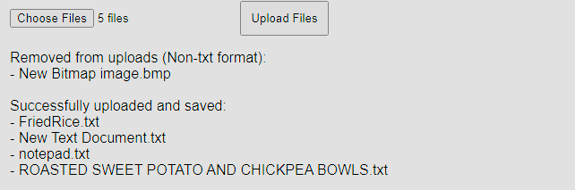

# RAG-application-using-LlamaIndex
The proposed web application leverages LlamaIndex for enhancing the capabilities of a large language model with Retrieval-Augmented Generation (RAG). RAG optimizes the output by referencing an external, authoritative knowledge base, allowing for more accurate and contextually relevant responses based on the latest ingested data.

## Implementation Details
This application is built using FastAPI, a modern, fast (high-performance) web framework for building APIs with Python. The application consists of three primary endpoints designed for document ingestion, querying, and serving the web interface.

### Endpoints
#### 1. POST `/ingest`:
**Functionality**: This endpoint allows users to upload text documents via a web interface or directly through the API. The uploaded documents are then ingested into LlamaIndex, creating a searchable index that enhances the model's response capabilities.
**Key Features**: 
- Able to filter out non-text file formats. 
- Processing large files in manageable chunks to optimize memory usage and performance. 
- Efficiently indexes large volumes of text to facilitate rapid retrieval and effective memory management.
note: Index are currently stored locally in the project respiratory, for future scaling purpose switching to a vector database (e.g. Pinecone) would be more ideal
- Able to manage various type of errors and return clear and concise error messages
#### 2. GET `/query`:
**Functionality**: Users can submit search queries through this endpoint. The application uses LlamaIndex's AI-driven search capabilities to fetch relevant information from the indexed documents.
**Key Features**: 
- Provides quick and relevant responses based on the context of the indexed documents. 
- Supports complex query types, offering flexibility in information retrieval.
- Able to detect and handle case where empty query is parsed to the API.
#### 3. GET `/`:
**Functionality**: Serves as the main entry point for the web application. This endpoint delivers the user interface, enabling easy access to both the ingestion and querying functionalities.
**Key Features**: 
- User-friendly interface that guides users through document upload and querying processes. 

### Real-Time Updates
The application supports real-time updating of the index whenever new documents are ingested via the **POST `/ingest`** endpoint. This ensures that the knowledge base is continually evolving and that queries return the most up-to-date information.

### Robustness in handling error
The APIs are designed to handle errors effectively to ensure smooth communication between different software components. The APIs are designed with several key strategies to enhance robustness and reliability:
1. **Clear Error Messages:** Providing clear and concise error messages that help developers understand what went wrong.
2. **HTTP Status Codes:** The APIs utilize appropriate HTTP status codes to clearly indicate the type of error encountered.  (e.g., 400 for client errors, 500 for server errors).


# Requirements
## Setting up the Environemnt
To run this project, you need to install its dependencies. You can do so by using the following pip command in your terminal:

```bash
pip install -r requirements.txt
```

Alternatively, if you prefer to use a virtual environment, a setup is included in the `userenv` folder. You can activate this environment to manage dependencies separately from your global Python installation.

### Setting the API Key
1. Open up openai_key.env using any text editing tools (e.g. notepad)
2. Replace the 'YOUR_API_KEY' with your own OpenAI API key

## Running the Application
### Setting up the Server
1. Open a command prompt.
2. Change directory to where `main.py` file is located using:
   ```bash
   cd path_to_your_directory
   ```
3. Run the application with:
   ```bash
   uvicorn main:app
   ```
   If you encounter an error saying `'uvicorn' is not recognized as an internal or external command`, run the server using:
   ```bash
   python -m uvicorn main:app
   ```

### Using the Main Interface

Access the web interface by navigating to the localhost server main endpoint, which is shown after succesfully starting up uvicorn through the command, an example is shown as image below:

From here, you can access the functionalities for file upload and querying:

#### File Upload

- Use the 'Choose File' button in the main interface to select one or multiple files you wish to upload.
- Click 'Upload Files' to submit the files.
- Files will be uploaded, ingested, and saved as index through the **POST `/ingest`** endpoint
- The result of the upload will be displayed once the process is completed.


### Query from File
#### Through main interface
- Type your query into the message textbox and click the 'Send' button.
- The query will be sent to **GET `/query`** endpoint and generate a response
- The input and response text will be displayed in the message box.


#### Through endpint directly
- While the server is running in the background, navigate to your browser and type the following in the address bar: **{Server URL and port}/query?query="{Insert Your Query here}"**

An example would be **ht<span>tp<span>://127.0.0.1:8000/query?query="How many eggs for a fried rice"**

A response will be given in JSON format: {"query":{Your Query text},"results":{Response Generated}}

# Try it yourself
Try the project yourself by following the instructions below:

> 1. Try asking for "Top 1 ranking team in year 2003", the chatbot should output wrong answer, as it's not included in the dataset.
> 2. Now go to '/sample' folder in the directory, upload the "ranking-2003.txt" and "Trash data.BMP" through the web interface. The BMP file should be removed from the upload as it's not the correct format *(Automatically filter out non-text file formats)*
> 3. Once the file are successfully uploaded, ask the same question again, it should give the correct answer based on the data uploaded *(Real-time update Query Engine)*
> 4. Go back to the directory, you will find that no files are being added to the folder *(Remove temp files after no longer needed)*
> 5. Try again, now with your own data, you may also test out things like: Large file upload, empty upload (By clicking the upload button without any files selected), Empty query texts (Only visible to user when using the endpoint directly) etc
